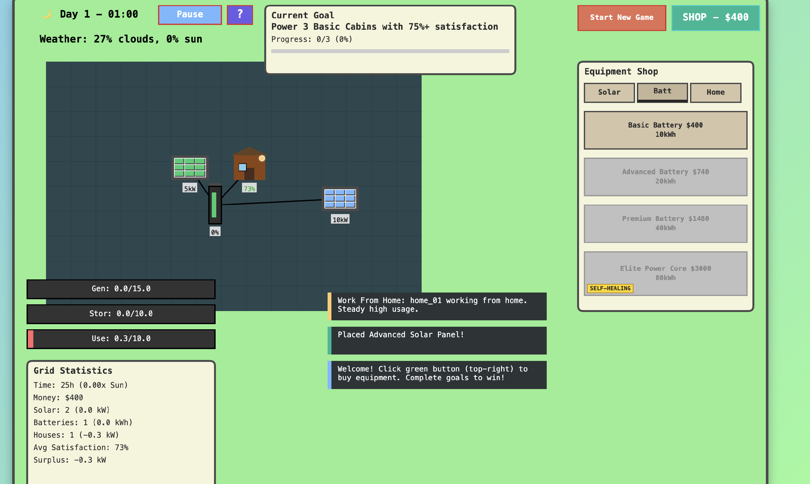

# Solar Microgrid Management Game

## Overview
The Solar Microgrid Management Game is a browser-based simulation where you manage a renewable energy microgrid. Your goal is to balance energy generation, storage, and consumption while keeping your community powered through changing weather conditions and crisis events.



## Gameplay & Mechanics

### Core Loop
1.  **Generate Power**: Install solar panels to generate electricity during the day.
2.  **Store Energy**: Use batteries to store excess power for use at night or during storms.
3.  **Manage Demand**: Power households and businesses. If you run out of power, blackouts occur!
4.  **Survive Crises**: Weather events (storms, clouds) and equipment failures will test your grid's resilience.

### Systems
*   **Day/Night Cycle**: Solar panels only work during the day (6 AM - 6 PM). You must store enough energy to last through the night.
*   **Weather System**: Cloud cover and storms dynamically reduce solar output. Watch the forecast!
*   **Economy**: Earn money by maintaining uptime. Spend it in the Shop to upgrade your grid.
*   **Events**: Random events (like "Grid Overload" or "Maintenance Required") require quick decision-making.

### Controls
*   **PC**: Mouse click to interact with UI buttons and place buildings.
*   **Mobile**: Touch controls with pinch-to-zoom support for navigating the grid.

## Mobile Support (Work in Progress)
We are currently actively developing mobile support with the following targets:
*   High-resolution rendering (Retina/High DPI)
*   Full touch interface support
*   Responsive UI that adapts to phone and tablet screens

## Technical Details

### Architecture
*   **No Frameworks**: Pure Vanilla JS (ES6+) and HTML5 Canvas.
*   **No Build Tools**: Runs directly in the browser.
*   **State Management**: Centralized `GameState` class.
*   **Rendering**: Custom procedural rendering engine with particle effects for energy flow.

### Running the Game
Since there are no build steps, you just need to serve the files:

**Option 1: Python**
```bash
python -m http.server 8000
```

**Option 2: Node.js**
```bash
npx http-server -p 8000
```

Then visit `http://localhost:8000`

## Development
See `AGENTS.md` for coding conventions and `tasks.md` for the development roadmap.

## Changelog

### 2026-01-31 - Mobile UI Improvements
- **Camera System**: Added pinch-to-zoom and pan controls for mobile devices
- **Mobile UI Components**: Implemented slide-out drawer for shop, bottom sheet for entity selection
- **Touch Gestures**: Added touch drag for placement mode, long-press for entity selection
- **Layout Fixes**: 
  - Centered goal panel in landscape mode
  - Moved energy bars to bottom-left to avoid overlapping game grid
  - Made stats panel visible on mobile with proper background positioning
  - Repositioned notifications to bottom area aligned with stats
  - Added affordability check to upgrade button (grays out when insufficient funds)
